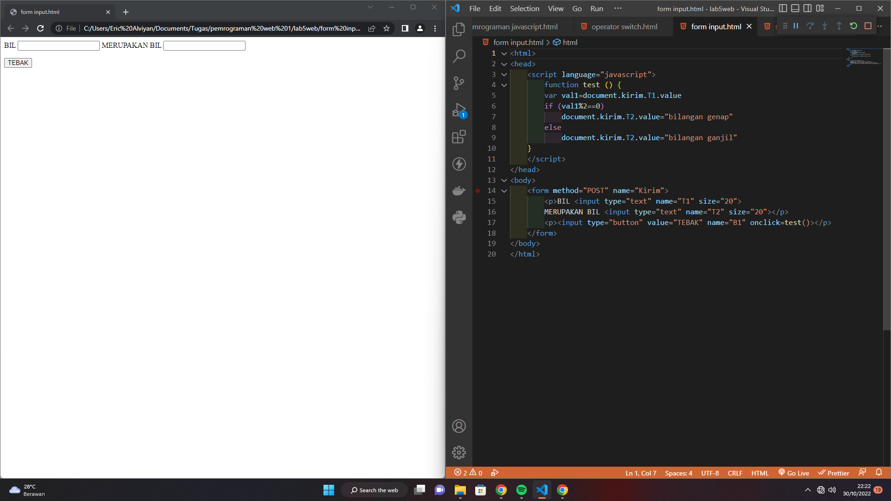

# lab5web
## Membuat Dasar Pemrograman Javascript

### pengenalan javascript

### memasukan fungsi alert

### pemasukan data

### pemanggilan fungsi

### percobaan membuat skrip javascript

### contoh dasar pemrograman javascript

### contoh if-else

### contoh operator switch

### contoh form input

### contoh object dokumen

### contoh validasi data

